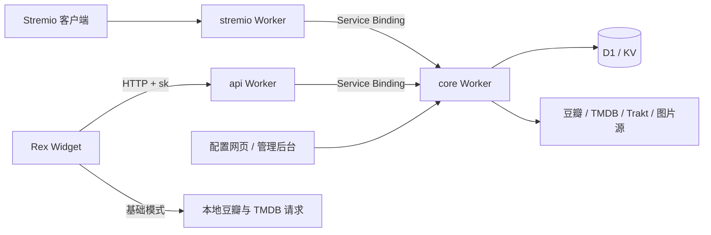

# Douban Bridge：三 Worker 与 Rex 云端优先设计

- 日期：2026-09-13
- 更新：2026-09-14，暂缓季级改造。
- 状态：产品边界已确认；季级改造已暂缓，本文供书面审阅；尚未实施。
- 源码基线：`35b2633`。
- 讨论来源：Codex 任务《评估项目插件化形态》及本任务的逐轮设计讨论。

## 1. 目标与范围

让现有豆瓣项目同时服务 Stremio 与 Rex，保留现有云端维护的豆瓣到 TMDB / IMDb 映射，以及用户保存的封面规则。

Rex 通过多个列表模块提供影视发现能力。具备有效 `sk` 和 Star 权益时，列表与详情直接请求云端完整结果；没有 `sk` 或云端请求失败时，插件静默使用本地基础模式。

本文定义 Rex 模块、云端接口、本地回退、封面配置，以及三个 Worker 的部署边界。仓库改为 monorepo，包含 `core`、`stremio`、`api` 三个 Worker app，以及不部署为 Worker 的 `rex-widget` 脚本 app。具体迁移步骤和仓库重命名不在本文执行；仓库名称不影响本设计。

本轮不增加片源抓取、视频托管、观看记录同步、云片单规则引擎、私人豆瓣 Cookie 托管或通用 RPC / SDK 产品。

## 2. 已确认的产品决策

| 项目 | 决策 |
| --- | --- |
| 云端价值 | 持续维护的豆瓣到 TMDB / IMDb 映射，以及按账号配置生成的封面结果 |
| 列表 | 有效 `sk` 时直接请求云端完整列表 |
| 详情 | 与列表相同：云端优先，本地兜底 |
| 本地基础模式 | 请求豆瓣，尽力匹配 TMDB；匹配失败保留豆瓣条目 |
| 云端匹配失败 | 保留豆瓣条目和已有外部 ID，不在插件重复进行本地匹配 |
| 云端服务失败 | 静默回退基础模式，不依赖提示条、弹窗或额外错误页面 |
| 封面规则 | 用户在网页保存，云端按规则生成最终图片 URL |
| 列表入口 | 一个 Widget 暴露多个模块 / 列表方法，各有对应参数 |
| 榜单选择 | 由 Rex 模块及其参数决定，不以网页保存的 Stremio 目录选择代替 |
| 接口形式 | 普通 HTTP + JSON，Rex 调用携带 `sk`；不引入 RPC |
| `sk` 含义 | 本服务的 secret key，用来关联账号、权益与配置 |
| Worker 划分 | 管理后台与核心放在一个 Worker，Stremio 与 Rex 接口各自独立部署 |
| 季级改造 | 暂缓，首版沿用现有整剧映射与图片逻辑 |

以下各节将这些决策落实为最小技术约定。它们描述目标行为，不表示当前代码或 Rex 真机已经满足全部条件。

## 3. 应用、部署与配置的职责

### 3.1 三个 Worker，四个 app

第三个 Worker 命名为 `api`，表示项目的数据接口；Rex 是当前调用方。管理后台与核心所在 Worker 在内部命名为 `core`，其公开网页使用 `dash` 域名。接口名称不绑定某个播放器，也不因此扩大首版功能范围。

| Worker / app | 目标公开域名 | 职责 |
| --- | --- | --- |
| `stremio` | `stremio-addon-douban.baran.wang` | 保留已有 Stremio 安装入口与协议 |
| `core` | `douban-bridge-dash.baran.wang` | 用户配置、管理后台、登录；内部承载共享数据能力 |
| `api` | `douban-bridge-api.baran.wang` | 对客户端提供带 `sk` 的数据接口 |

这三个域名是部署设计；本轮只写文档，不创建 DNS 记录或修改线上路由。`core` 的内部数据入口只通过 Service Bindings 访问，不因配置了 `dash` 域名就成为公开 API。

```text
apps/
  core/          # Worker：管理后台、配置页、账号与共享数据能力
  stremio/       # Worker：旧 Stremio 协议与兼容入口
  api/           # Worker：项目数据接口，当前由 Rex 调用
  rex-widget/    # 静态 Widget 脚本构建产物，不是 Worker
packages/
  contracts/     # 跨 app 使用的最小数据类型与接口结构
```



三个 Worker 各自具有构建和部署配置；Widget 独立构建并按脚本清单分发。`contracts` 只共享实际使用的接口结构，不放 Worker 上下文、数据库客户端、业务凭据或新的运行框架。

拆分的收益是两个客户端协议可以独立发布、保持自己的公开路由，数据维护只做一份。代价是维护三个部署配置及内部接口兼容；`core` 仍是共享依赖，拆分不提供核心数据服务的故障隔离。

### 3.2 `core` Worker

`core` 承载当前管理后台、用户配置页、GitHub OAuth / Star 校验、`sk` 管理，以及豆瓣数据获取、映射查询与补全、人工校正、图片生成和底层缓存。

D1、业务 KV、上游服务凭据和定时校正任务只配置在 `core`。两个适配 Worker 不直接访问业务数据库，也不分别运行 cron。继续使用现有数据实例，避免迁移时复制映射数据或重复调度。

复用现有 API facade、映射持久化、`ImageUrlGenerator` 和底层请求缓存。每次内部服务请求及定时任务都建立现有 AsyncLocalStorage 上下文；依赖上下文的客户端不会被直接导入其他 Worker 或 Widget。

### 3.3 `stremio` Worker

`stremio` 负责原有 manifest / catalog / meta 协议和 Stremio 响应格式，通过内部绑定取得 `core` 的数据结果。保留原有安装地址、配置路径及客户端行为；不要求现有用户重新安装或填写 `sk`。

旧域名上的配置页、OAuth 回调、管理入口和图片代理路径，通过明确列举的兼容路由转发给 `core`。保持原始请求 URL、Cookie 和响应头的语义，不以更换域名或重定向为默认迁移手段。不能增加一个可访问任意 `core` 路径的通用公开代理。

### 3.4 `api` Worker

`api` 在 `douban-bridge-api.baran.wang` 暴露第 6 节定义的公开 HTTP 接口，接收 `sk`、模块参数和分页，调用 `core` 并返回数据契约。传输层输入检查、错误响应及协议适配在此完成；账号鉴权、Star 权益和个性化配置在 `core` 统一校验。

它不复制映射算法、不保存另一份用户配置，也不接入 D1 / 业务 KV。需要对外提供的图片访问路径仅做有明确范围的代理适配，图片授权和选图逻辑仍属于 `core`。

### 3.5 Worker 间调用

两个适配 Worker 使用 Cloudflare Service Bindings 调用 `core`，不绕经公开域名。首版使用绑定的 `fetch` 传递普通 Request / Response，不引入 JSON-RPC 或客户端 RPC 框架。

`core` 的默认 HTTP 入口服务 `douban-bridge-dash.baran.wang` 的网页和管理路由；内部业务通过独立的命名 `WorkerEntrypoint` 提供，并由绑定指定目标入口。分别为 `api` 与 `stremio` 提供内部入口，`api` 入口强制验证 `sk`，`stremio` 入口接受既有配置标识和权限规则。不能靠请求参数或可伪造的请求头切换为另一种权限。

内部数据入口不挂在默认公开路由上，外网不能直接调用。`WorkerEntrypoint.fetch` 仍使用 HTTP Fetch 语义；Cloudflare 的命名入口用于能力隔离，不改变用户已确认的普通 HTTP 接口选择。

部署按 `core`、适配 Worker、Widget 的依赖顺序进行。新增内部字段先保持可选，保留旧消费者兼容，直到相应适配器完成迁移。具体路由清单、OAuth 回调和 Cookie 兼容核对在实施计划中逐项列出。

### 3.6 `rex-widget` 与配置归属

Widget 定义模块、参数和返回条目适配。各列表方法通过共同的请求流程访问 `api`，失败后调用对应的本地流程。

Rex 保存模块选择、模块参数、当前分页位置和本服务 `sk`。`core` 的网页保存图片源顺序、图片语言等账号封面规则，以及这些提供方需要的凭据。Widget 无需获得用户的云端图片提供方密钥。

多个模块共用账号封面规则。Rex 的模块选择不改写网页上的 Stremio `catalogIds`；现有账号仍共用一份 `imageProviders` 配置。

## 4. 模块模型

官方清单列出 Widget 脚本；每个脚本的 `WidgetMetadata.modules` 再声明多个模块。模块通过 `functionName` 指向列表函数，通过 `params` 声明枚举、输入、分页和语言等参数。

官方 `rex-tmdb.js` 的“正在热映”“趋势”“高分内容”“片单”等分别对应多个函数，并复用公共请求函数。豆瓣 Widget 采用同样的结构。

首版模块以现有已实现的目录为来源，覆盖当前 13 个默认目录，并复用已有类型榜单、年度榜单的解析能力。模块标题使用现有中文目录名，模块 ID 保持稳定。相同数据来源的不同选项可由参数表达，避免复制请求和回退逻辑。

允许输入已有豆瓣集合 ID 的入口可以复用同一列表能力；不把任意豆列 URL、私人片单或新的解析器当成已经存在的功能。此类新增来源需要单独确认并实现后才能暴露。

多个列表函数不会产生多套后端：模块统一映射到集合标识和参数，共用同一个列表接口。当前每页 20 条；Rex 的 `page` 从 1 开始时，转换为 `skip = (page - 1) * 20`，使用 `offset` 时直接传入 `skip`。

## 5. 请求流程

### 5.1 列表

1. 用户选择模块，Rex 调用该模块对应的函数并传入参数。
2. 没有 `sk` 时，直接进入本地基础模式。
3. 有 `sk` 时，向 `api` 发送集合标识和分页 / 类型筛选参数；由该 Worker 通过内部绑定转交 `core`。
4. `core` 校验凭证与权益，读取该账号的封面规则，获取当前页豆瓣条目。
5. 按本页豆瓣 ID 批量查询已有映射。只对缺失项运行现有即时匹配流程，并异步持久化结果。
6. 云端按用户规则生成图片 URL，返回当前页完整列表；保持豆瓣来源的顺序，不因某项增强失败删除条目。
7. 插件转换成 Rex 条目并返回。云端请求失败时，调用相同集合和分页参数的本地基础流程。

普通成功请求只使用云端路径，不同时发起一份本地豆瓣请求。批量查库和缺失项补全由同一次云端请求完成，插件不追加一轮“找缺项再补查”。

### 5.2 详情

详情携带稳定的豆瓣 ID 回到对应流程。有有效 `sk` 时请求云端详情，无 `sk` 或云端失败时请求本地豆瓣详情。

云端详情返回完整简介及展示所需的已有详情字段、外部 ID 和图片结果。即使没有先浏览列表、直接打开详情，也必须能够查询已有映射并对缺失项尽力补全。

现有 Stremio `meta` 路由只读映射、缺失时插入待处理记录；它不能不加处理地充当上述 Rex 详情接口。新接口应复用列表侧的解析能力实现该目标，既有 Stremio 路由行为不在本次文档变更中修改。

列表阶段不为每条记录获取演员、奖项、完整简介等仅供详情展示的字段。匹配外部 ID 所需的豆瓣详情片段仍允许按需获取。

### 5.3 基础模式与错误分类

| 情况 | 插件行为 |
| --- | --- |
| 未配置 `sk` | 直接本地请求豆瓣，尽力匹配 TMDB |
| `sk` 无效、撤销或没有 Star 权益 | 本次调用静默使用基础模式，不自动删除用户填写的 `sk` |
| 云端网络失败、限流、服务错误或响应结构不可用 | 本次调用静默使用基础模式，不再次请求同一云端接口 |
| 云端成功但部分条目无外部 ID | 使用云端返回的豆瓣条目，不在插件重复匹配 |
| 云端返回合法空列表 | 返回空列表，不把正常分页结束当成故障 |
| 图片提供方无结果 | 按账号规则继续尝试下一图片源；所有允许的源无结果时保留空字段 |
| 本地豆瓣也失败 | 保留宿主正常的请求失败行为，不伪造成功空列表 |

云端成功时以云端的图片字段为准。不能因插件另有豆瓣图片，就覆盖已经选好的云端图片，或绕过用户限定的图片源顺序。基础模式允许使用本地成功匹配到的 TMDB 图片，最终回退豆瓣图片。

没有外部映射不等于服务失败，也不保证永远不再尝试：同一次请求不会重复查同一条；后续请求和定时任务仍按现有规则处理。首版不额外建立负缓存或任务队列。

## 6. HTTP 契约

`api` Worker 首版在 `https://douban-bridge-api.baran.wang` 提供两个公开只读接口，具体约定如下；这些路径不挂在 `stremio` Worker 或 `core` 的网页入口：

| 接口 | 输入 | 输出 |
| --- | --- | --- |
| `GET /v1/catalog/:collectionId` | `skip`，可选 `genre` | `{ items: [...] }`，当前页完整列表 |
| `GET /v1/meta/:doubanId` | 路径中的豆瓣 ID | `{ item: ... }`，单条完整详情 |

两者均使用 `Authorization: Bearer <sk>`。路径中不包含原始密钥，也不把用户的图片提供方凭据传到客户端。

服务端校验集合标识、豆瓣 ID、非负整数 `skip` 和支持的筛选参数。接口接受已支持的集合标识，不接受客户端指定任意上游 URL。年度榜单标识和分类筛选沿用现有解析规则。

列表条目的最小字段集合：

| 字段 | 语义 |
| --- | --- |
| `doubanId` | 必填，稳定的豆瓣条目标识 |
| `mediaType` | 必填，`movie` 或 `tv` |
| `title` | 必填，展示标题 |
| `description`、`year`、`rating` | 豆瓣已有的基础展示信息，可缺失 |
| `tmdbId`、`imdbId` | 可用的外部 ID，无结果时为空 |
| `images.poster`、`images.background`、`images.logo` | 按账号规则生成的最终 URL，无结果时为空 |

详情在同一条目结构上提供完整简介，以及当前豆瓣源已经提供的演职员等详情数据。仅增加 Rex 展示实际用到的字段，不为未来客户端提前扩大契约。

以上是服务接口字段，不能假设 Rex 会保留同名自定义字段。Widget 需转换为宿主支持的 `id`、`type`、`title`、`posterPath`、`backdropPath`、`link` 等字段。

错误使用 HTTP 状态码；凭证无效为 401，权益不足为 403，输入不合法为 400，来源不存在为 404，限流为 429，上游不可用为 5xx。合法的空列表和个别条目匹配失败仍返回 200。插件统一按第 5.3 节处理服务失败。

首版不暴露额外的客户端批量详情接口。列表接口内部一次接收目录请求、按页批量查映射，已覆盖当前需求。

## 7. 映射与图片的复用边界

现有 `douban_mapping` 保存豆瓣、TMDB、IMDb、Trakt ID、`calibrated` 及时间字段。已有外部 ID 应保留；空的新结果不得清空旧 ID，人工校正结果不得被自动匹配覆盖。

云端继续复用 `api.fetchIdMapping`、`api.findExternalId` 和 `api.persistIdMapping`。现有即时匹配先尝试从豆瓣详情片段获取 IMDb，再调用 Trakt；没有 IMDb 时采用已有标题搜索逻辑。定时校正继续复用既有工作流。本轮不更换算法或宣称所有条目都有映射。

“批量补全”表示在服务端协调本页缺失条目的处理。当前豆瓣上游没有在本项目中使用的批量详情接口；底层仍可能发出多个单条请求，复用既有缓存与相同请求去重。

单条非关键增强失败应降级为缺字段，不能使整页失败。图片复用 `ImageUrlGenerator` 按源顺序补齐海报、背景图和 logo。云端返回 URL，不把选图策略交给插件再实现一遍。

### 暂缓项：季级映射

2026-09-14，用户决定先不改季级支持。Rex Widget 的季定位能力尚未确认，首版沿用现有整剧映射与图片逻辑。季字段、季匹配与人工校正、季海报、历史补季及季定位验收均不纳入本次重构，也不作为三 Worker 和云端优先流程的前置条件。后续确认宿主能力及实际需求后再单独设计。

## 8. `sk`、缓存与图片访问

### 8.1 最小凭证约定

`sk` 是本服务的只读能力凭证，服务端通过它关联现有账号和配置，并使用现有 Star 校验规则判断权益。它不替代 GitHub OAuth token 或豆瓣 Cookie，也不允许调用配置写入或管理员接口。

首版按账号管理一个可替换的有效密钥即可，不增加设备列表、多密钥管理产品或新套餐。密钥使用高熵随机值、服务端保存验证用摘要；重新生成后旧密钥失效。客户端只需配置该值，日志不得输出密钥或鉴权头。具体存储迁移在实施计划中落实，遵守仓库不引入 Drizzle 外键的约束。

### 8.2 缓存约定

当前集合分页、详情和上游图片请求已有缓存；映射已有 D1 存储。这些与账号展示偏好无关的数据可继续按各自已有规则复用。

现有 `response-cache.ts` 的整页缓存键仅包含请求 URL。新接口将身份放在 Bearer 头中，相同 URL 可能对应不同账号，因此不能直接照搬该缓存。

首版新接口由 `core` 先鉴权、读取当前账号配置，再构建响应；`core` 与 `api` 都不缓存整份个性化最终响应，对外使用 `Cache-Control: private, no-store`。复用 `core` 的底层数据缓存即可。后续若确需缓存最终响应，必须同时解决账号隔离、配置变更失效和凭证权益校验，不能只增加 TTL。

Widget 首版不额外缓存个性化最终列表；宿主模块缓存需使用经真机确认的关闭或失效机制。不能承诺网页修改立刻刷新已经打开的列表，但下一次实际服务请求必须使用保存后的配置。

### 8.3 图片 URL

返回的 URL 必须能被 Rex 的图片加载器独立访问。不能假设图片请求会携带列表接口的 Bearer 头，也不能在图片 URL 中塞入用户的原始 `sk`。

既有图片代理需要核对真实鉴权与客户端访问路径。若需要受控代理 URL，使用仅允许读取特定图片的服务端验证凭证；保持上游地址校验，不开放任意 URL 代理。优先复用可用的既有图片访问能力，不预先新增图片存储服务。

## 9. Rex 宿主适配与验证门槛

已读取官方在线 manifest、`rex-tmdb.js` 和 `bangumi.js`。它们证明一个 Widget 可以暴露多个列表模块，方法使用 `async` / `await`，并将结果转换为宿主的条目字段。

本机 macOS 原生 JavaScriptCore 已执行探针：`Promise.race`、`Promise.all` 均存在且能正确处理已完成的 Promise；裸引擎中的 `setTimeout`、`AbortController` 为 `undefined`。这是本机引擎证据，不是 Rex 真机证据。

首版云端优先流程不依赖请求竞速或返回后更新列表。不得仅凭 Node 模拟器或类型声明，承诺 Rex 支持自定义计时器、HTTP 取消、渐进列表更新或任意字段透传。

实施前需在目标 Rex 版本完成以下能力验证：

1. **模块与凭证参数**：多个列表模块及各自参数能正常配置；共用 `sk` 的参数传递真实可用，不把本地 SDK 的 `globalParams` 声明当作 UI 验证。
2. **列表 ID 与详情路由**：条目保存可恢复的豆瓣 ID，同时利用 TMDB / IMDb 做资源识别；点击后能够进入所设计的云端优先详情路径。不能假定未知自定义字段会被宿主保留。
3. **无片源详情**：插件只提供发现与元数据。不能为了满足某个类型声明而伪造 `videoUrl` 或新增片源功能。若宿主只允许带播放地址的自定义详情，须记录限制并重新审阅详情适配方案。
4. **图片展示**：自定义海报、背景图 URL 在列表和详情中实际生效，且不会被宿主自动元数据覆盖；代理图片无需额外鉴权头也能加载。
5. **失败与超时**：模拟云端拒绝、断网和长时间无响应。必须确认宿主请求能在有限时间内失败并进入回退；若默认超时不适用，应使用已验证的宿主机制或服务端请求期限，不能凭空使用 `setTimeout`。
6. **缓存更新**：更改网页封面规则、替换 `sk` 后，下一次实际请求不使用旧账号或旧配置结果；验证宿主模块缓存的影响。

这些是实施和发布的验收门槛，不是尚待用户选择的产品功能。某项能力验证失败时，不能以构建通过代替目标体验，也不能静默降低已确认的云端封面或详情要求。

## 10. 验收标准

| 场景 | 必须观察到的结果 |
| --- | --- |
| 无 `sk` 加载列表与详情 | 不调用受保护云端接口，基础模式可用 |
| 有效 `sk` 加载两个不同模块 | 参数传到同一个云端列表能力，目录内容和顺序正确 |
| 列表翻页、年度榜单、类型筛选 | page / skip 换算正确，复用现有目录解析，不重复或串页 |
| 人工校正的条目 | Rex 获得校正后的外部 ID，自动匹配未覆盖记录 |
| 缺失映射、冷缓存 | 一次云端请求内尽力补全，插件没有第二轮批量补查 |
| 仍无法匹配的条目 | 保留豆瓣条目，插件不重复本地匹配 |
| 一个条目或图片提供方增强失败 | 其余条目正常返回，用户允许的图片回退顺序生效 |
| 云端空列表 | 正常结束该页，不触发本地回退 |
| `sk` 失效、权益不足、限流、网络失败 | 本次调用静默回到基础模式，无重复云端重试 |
| 云端与本地均失败 | 请求失败可被宿主识别，不伪造成功结果 |
| 两账号请求相同目录 | 各自得到自己的封面规则结果，不命中另一账号的最终响应 |
| 网页修改封面规则 | 下一次实际云端请求使用新规则 |
| 列表和直接打开详情 | 豆瓣身份可恢复，详情走云端优先流程，封面符合账号规则 |
| 真实图片加载与媒体识别 | 在 Rex 中看到正确图片并识别目标影片 / 剧集，而非仅验证 HTTP 200 |
| 旧 Stremio 安装 | 原 manifest、目录、详情和配置路径继续可用 |
| 三个 Worker 的权限与资源 | 只有 `core` 绑定业务 D1 / KV、持有上游凭据并执行 cron；两个适配器通过 Service Bindings 工作 |
| 内部服务隔离 | 公开请求不能调用命名内部入口或通过参数切换为 Stremio 权限 |
| 旧配置页、登录和图片路径 | 经 Stremio 兼容路由访问仍可用，OAuth / Cookie 语义和图片加载正常 |

实施阶段运行仓库要求的构建验证，并为新增鉴权、回退和响应契约留下可运行的检查。引入测试时先建立适用的 runner / 配置，遵守当前仓库没有测试基础设施的约束。文档阶段不运行与文件内容无关的应用构建。

## 11. 依据与后续交付

官方实现（读取于 2026-09-13）：

- [Rex 官方模块清单](https://assets.rexnow.tv/scripts/manifest.json)
- [Rex TMDB 1.2.1](https://assets.rexnow.tv/scripts/rex-tmdb.js)：多模块、模块参数、公共数据请求函数及条目转换。
- [Rex Bangumi 1.0.1](https://assets.rexnow.tv/scripts/bangumi.js)：多个列表入口复用公共远端数据获取。
- [官方 Widget 协议 README](https://github.com/InchStudio/ForwardWidgets/blob/master/README.md)：异步处理函数与列表返回协议。
- [Promise.race 标准行为](https://developer.mozilla.org/en-US/docs/Web/JavaScript/Reference/Global_Objects/Promise/race)：取首个完成状态，不取消其余操作。
- [Cloudflare HTTP Service Bindings](https://developers.cloudflare.com/workers/runtime-apis/bindings/service-bindings/http/)、[命名入口](https://developers.cloudflare.com/workers/runtime-apis/bindings/service-bindings/rpc/)、[WorkerEntrypoint.fetch 语义](https://developers.cloudflare.com/workers/runtime-apis/rpc/reserved-methods/)：内部 HTTP 调用、命名入口隔离和 Fetch 行为。

本仓库依据：

- `src/libs/collections.ts`：默认目录、类型与年度榜单。
- `src/routes/catalog.ts`：分页、映射批量读取、缺失项匹配和图片生成。
- `src/routes/meta.ts`：既有详情行为及其与目标 Rex 详情的差异。
- `src/libs/api/index.ts`、`src/cron.ts`：即时匹配、持久化和定时校正。
- `src/libs/api/base.ts`、`src/libs/api/douban/index.ts`：上游请求缓存、去重与每页 20 条。
- `src/libs/images.ts`、`src/libs/config.ts`、`src/db/schema.ts`：图片规则、账号配置和映射结构。
- `src/libs/response-cache.ts`、`src/routes/image-proxy.ts`：新 Bearer 接口不可直接沿用的整页缓存与图片访问边界。

本文审阅后，再编写实施计划：先完成第 9 节的宿主能力验证及命名入口隔离验证，再按三个 Worker 的依赖安排迁移、接口、适配器和必要的凭证存储变更。实施计划必须具体列出文件移动、每个 Worker 的绑定与部署配置，以及旧 Stremio 安装、登录和图片路径的兼容检查。
